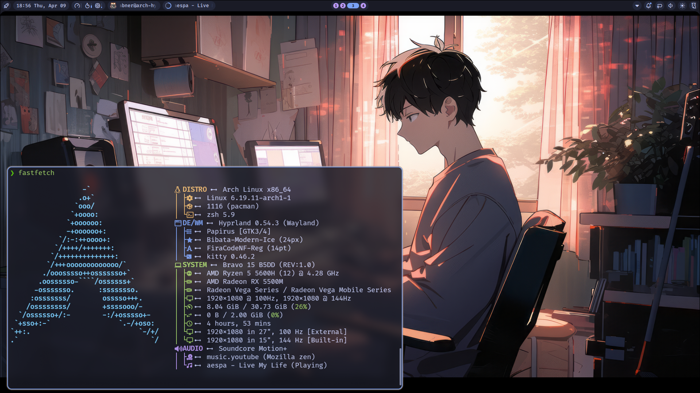

# Arch Linux + Hyprland Dotfiles

Personal dotfiles for **Arch Linux + Hyprland**.
Managed with a **bare git repository** tracked via the `dot` alias — no symlinks
required.

<!-- markdownlint-disable -->

<!-- toc -->

- [What's Included](#whats-included)
- [First Time Setup](#first-time-setup)
- [Syncing Dotfiles](#syncing-dotfiles)
- [Installing Packages](#installing-packages)
- [System Cleanup](#system-cleanup)
- [Setting Up a New Machine](#setting-up-a-new-machine)
- [Submodules](#submodules)
- [Documentation](#documentation)
- [References](#references)

<!-- tocstop -->

<!-- markdownlint-enable -->

## Preview


## What's Included

| Group | Files / Directories |
|---|---|
| **Shell** | `.zshrc`, `.zprofile`, `.p10k.zsh` |
| **GTK** | `.local/share/icons/Bibata-Modern-Ice`, `.config/gtk-3.0/`, `.config/gtk-4.0/` |
| **Neovim** | `.config/nvim/` (NvChad — git submodule) |
| **Terminal** | `.config/kitty/`, `.config/ghostty/` |
| **Compositor** | `.config/hypr/` |
| **Theming** | `.config/Kvantum/`, `.config/qt5ct/`, `.config/qt6ct/`, `.config/wallust/` |
| **Shell UI** | `.config/quickshell/`, `.config/rofi/`, `.config/swaync/`, `.config/waybar/` |
| **Utilities** | `.config/btop/`, `.config/cava/`, `.config/fastfetch/`, `.config/swappy/` |
| **Apps** | `.config/discord/settings.json`, `.config/noctalia/`, `.config/electron-flags.conf` |
| **OneDrive** | `.config/onedrive/config`, `.config/onedrive/sync_list` |
| **Meta** | `.local/bin/bootstrap.sh`, `.local/bin/dotfiles.sh`, `.local/bin/install-packages.sh`, `.local/bin/cleanup.sh`, `.gitconfig`, `.gitmodules`, `.gitignore`, `doc/`, `README.md` |

## First Time Setup

1. Create a bare repository:

   ```bash
   mkdir $HOME/.dotfiles
   git init --bare $HOME/.dotfiles
   ```

2. Add the `dot` alias to `.zshrc` or `.bashrc`:

   ```bash
   alias dot='git --git-dir=$HOME/.dotfiles/ --work-tree=$HOME'
   ```

3. Configure the remote and suppress untracked file noise:

   ```bash
   dot remote add origin <repo-url>
   dot branch -m main
   dot config --local status.showUntrackedFiles no
   ```

4. Run `dotfiles.sh` to stage, commit, and push all dotfiles:

   ```bash
   dotfiles.sh
   ```

## Syncing Dotfiles

`~/.local/bin/dotfiles.sh` automates staging all tracked paths, committing, and
pushing. Since `~/.local/bin` is in `PATH`, run it from anywhere:

```bash
dotfiles.sh
# or with a custom commit message:
dotfiles.sh -m "update hypr config"
```

For manual operations use the `dot` alias exactly like `git`:

```bash
dot status
dot diff
dot add ~/.config/hypr/hyprland.conf
dot commit -m "update hyprland config"
dot push origin main
```

## Installing Packages

`~/.local/bin/install-packages.sh` installs all dotfile dependencies on a
fresh Arch Linux system. It groups packages by purpose, checks what is already
installed, and presents an interactive selection menu (powered by
[fzf](https://github.com/junegunn/fzf) when available).

```bash
install-packages.sh          # interactive — pick groups with TAB, confirm with ENTER
install-packages.sh --yes    # skip final confirmation prompt
```

Package groups:

| Group | What's included |
|---|---|
| **Core Hyprland** | `hyprland`, `hyprpolkitagent`, `hyprlock`, `hypridle`, `hyprsunset`, portals |
| **Shell & Prompt** | `zsh`, `zsh-completions`, `fzf`, `lsd`, `fastfetch` |
| **Terminals** | `kitty`, `ghostty` |
| **File Manager** | `thunar` + plugins, `tumbler`, `gvfs` |
| **Bar & Notifications** | `waybar` |
| **Audio** | `pipewire` stack, `pamixer`, `pavucontrol`, `playerctl`, `mpv` |
| **Network & Bluetooth** | `networkmanager`, `network-manager-applet`, `bluez`, `blueman` |
| **Screenshot & Clipboard** | `grim`, `slurp`, `swappy`, `cliphist`, `wl-clipboard` |
| **Qt Theming** | `kvantum`, `qt5ct`, `qt6ct`, `nwg-look`, `nwg-displays`, `papirus-icon-theme` |
| **Fonts** | Nerd Fonts, Noto, Source Code Pro + `ttf-victor-mono`, `noto-fonts-tc-vf` (AUR) |
| **Input Method** | `fcitx5` + `fcitx5-chewing`, GTK/Qt modules |
| **Utilities** | `btop`, `cava`, `brightnessctl`, `rofi`, `jq`, `imagemagick`, and more |
| **Wallpaper & Colors** | `swww`, `wallust` (AUR) |
| **Session & Logout** | `wlogout` (AUR) |
| **GTK Theme & Cursor** | `adw-gtk-theme` (AUR) |
| **Cloud Sync** | `tailscale`, `onedrive-abraunegg` (AUR) |
| **Applications** | `obsidian`, `remmina`, `vlc`, `vesktop-bin`, `zen-browser-bin` (AUR) |
| **Neovim Editor** | `lazygit`, `neovim-nightly-bin` (AUR) |
| **Noctalia Shell** | `noctalia-shell` (AUR) |
| **ASUS ROG** | `asusctl`, `rog-control-center`, `supergfxctl` (AUR) |
| **AMD GPU Drivers** | `vulkan-radeon`, `lib32-vulkan-radeon`, `libva-utils`, `amd-ucode` |
| **Dev Tools** | `git`, `npm` |

AUR packages are installed via `yay` (the script installs `yay` automatically
if it is not found).

## System Cleanup

`~/.local/bin/cleanup.sh` frees disk space by cleaning caches and removing
orphaned packages. Each task shows the reclaimable size before you confirm.

```bash
cleanup.sh          # interactive — pick tasks with TAB, confirm with ENTER
cleanup.sh --yes    # skip confirmation prompts
```

| Task | What it does |
|---|---|
| **Pacman package cache** | `paccache -r` — keeps last 3 versions per package |
| **AUR build cache** | removes `~/.cache/yay/` — build dirs and tarballs |
| **Orphaned packages** | `pacman -Rns` — packages no longer required by any dep |
| **Systemd journal** | `--vacuum-time=2weeks` — discards logs older than 2 weeks |
| **npm cache** | `npm cache clean --force` — shown only when npm is installed |
| **Thumbnail cache** | removes `~/.cache/thumbnails/` — rebuilds on demand |

## Setting Up a New Machine

Run the bootstrap script on a fresh Arch Linux install — it handles everything
automatically:

```bash
bash <(curl -fsSL https://raw.githubusercontent.com/gin31259461/arch-dotfiles/main/.local/bin/bootstrap.sh)
```

**What `bootstrap.sh` does:**

1. Installs prerequisites (`git`, `rsync`, `base-devel`, `fzf`, `gum`) via pacman
2. Clones the dotfiles bare repo into `~/.dotfiles` and deploys files to `$HOME`
3. Configures git to hide untracked files in `$HOME`
4. Adds the `dot` alias to `.zshrc` if missing
5. Initialises all git submodules
6. Offers to install **Oh My Zsh** + plugins (`zsh-autosuggestions`,
   `zsh-syntax-highlighting`, `powerlevel10k`)
7. Offers to run `install-packages.sh` to install dotfile dependencies

**Flags:**

| Flag | Description |
|---|---|
| `--yes` / `-y` | Non-interactive — skip optional prompts and accept all defaults |
| `--repo <ssh-url>` / `-r` | Your dotfiles SSH remote (see below) |

**Using your own fork (`--repo`):**

Pass your SSH remote URL if you are not the default repo owner or want to
manage a personal fork. The script reads `~/.dotfiles-repo` (a small memory
file it writes on first run) to decide how to proceed:

| Scenario | Behaviour |
|---|---|
| No `--repo`, or URL matches `~/.dotfiles-repo` | SSH clone from your repo (HTTPS fallback if no key) |
| New URL (not in memory) | HTTPS clone of the default dotfiles as a base, then set your SSH URL as `origin` for future pushes |

```bash
# Fork owner or new user setting up for the first time:
bash <(curl -fsSL https://raw.githubusercontent.com/gin31259461/arch-dotfiles/main/.local/bin/bootstrap.sh) \
  --repo git@github.com:youruser/arch-dotfiles.git

# Short form also accepted:
bootstrap.sh --repo youruser/arch-dotfiles

# Re-bootstrap on a second machine (memory already saved on first machine):
bootstrap.sh --repo git@github.com:youruser/arch-dotfiles.git
# → memory matches → SSH clone directly from your repo
```

> **`~/.dotfiles-repo`** — written by `bootstrap.sh` after each successful
> clone.  Contains the SSH URL this machine's dotfiles remote is configured to.
> Not tracked by git (machine-specific).

<details>
<summary>Manual steps (if you prefer not to curl-pipe)</summary>

```bash
# 1. Clone into a temporary directory, then scatter files into $HOME
git clone --separate-git-dir=$HOME/.dotfiles \
  git@github.com:gin31259461/arch-dotfiles.git tmpdotfiles

rsync --recursive --verbose --exclude '.git' tmpdotfiles/ $HOME/
rm -rf tmpdotfiles

# 2. Suppress untracked file noise in the working tree
dot config --local status.showUntrackedFiles no

# 3. Initialise submodules
dot submodule update --init --recursive
```

</details>

## Submodules

[NvChad](https://nvchad.com/) (`.config/nvim`) is tracked as a git submodule
pointing to [gin31259461/nvchad](https://github.com/gin31259461/nvchad).

```bash
# After a fresh clone, pull submodule code
dot submodule init
dot submodule update --recursive

# Sync .gitmodules changes to .git/config
dot submodule sync --recursive

# Inspect registered submodules
dot config --get-regexp submodule
```

## Documentation

| Document | Description |
|---|---|
| [`doc/arch-install.md`](doc/arch-install.md) | Arch Linux dual-boot installation guide (15 steps: partitioning → GRUB → Hyprland) |
| [`doc/amd-gpu.md`](doc/amd-gpu.md) | AMD GPU setup: driver verification, Vulkan, VA-API, Hyprland env vars, performance monitoring |
| [`doc/live-usb.md`](doc/live-usb.md) | Create an Arch Linux Live USB: download, verify ISO, write with Rufus (Windows), dd (Linux), or Ventoy |
| [`doc/disk-migration.md`](doc/disk-migration.md) | Migrate an existing Arch Linux installation to a new drive using rsync |
| [`doc/disk-expand.md`](doc/disk-expand.md) | Expand an existing Arch Linux partition online (ext4/Btrfs/XFS) — no Live USB needed |
| [`doc/setup.md`](doc/setup.md) | Post-install configuration: Zsh, clipboard manager, Fcitx5 (Chinese input), VNC, CLI tools |
| [`doc/maintenance.md`](doc/maintenance.md) | System maintenance: cache cleaning, known upgrade issues, notes |
| [`doc/vm.md`](doc/vm.md) | Running Hyprland in VMware: known issues, extra mouse buttons, audio stuttering fix |

## References

- [A simpler way to manage your dotfiles](https://www.anand-iyer.com/blog/2018/a-simpler-way-to-manage-your-dotfiles/)
- [JaKooLit/Hyprland-Dots](https://github.com/JaKooLit/Hyprland-Dots) — config and script inspiration
